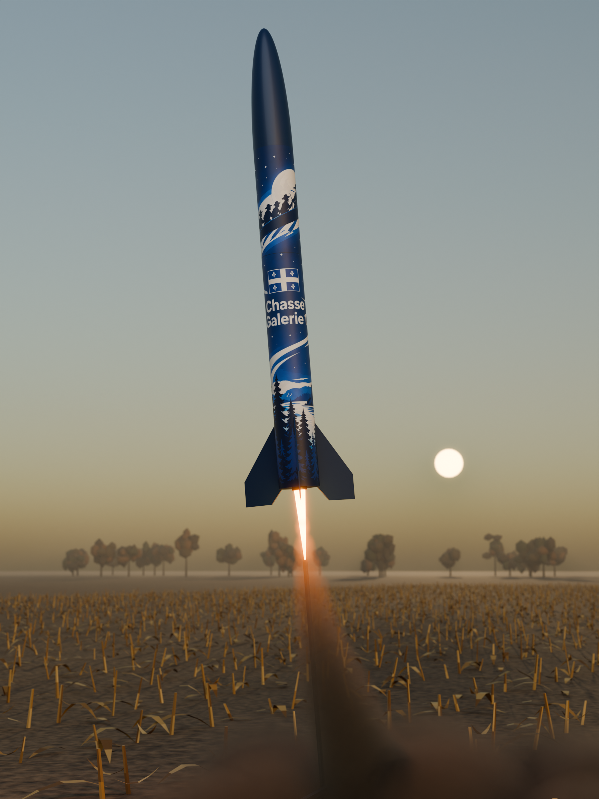
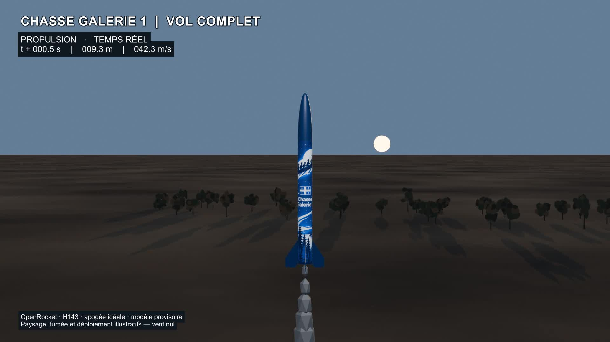

# Chasse Galerie 1 — Certification niveau 1

  

*Chasse Galerie 1 — Le sillage fleurdelisé. [Vue artistique du décollage et scène 3D modifiable](plans/rendus-artistiques/README.md).*

**Chasse Galerie 1** est le nom du projet et de la fusée, construite à partir du kit **LOC-IV 4 po de LOC Precision**.

Projet personnel de **Steve Prud’Homme** pour consigner sa préparation à la certification de niveau 1 auprès de l’Association canadienne de fuséonautique.

**État :** carnet en cours — notes et premier plan LOC-IV en brouillon • **Langue :** français

## Vidéo du vol complet

**[▶ Lire la vidéo MP4](plans/animations/vol-complet/chasse-galerie-1-vol-complet.mp4)** · [Scène Blender, données et méthode](plans/animations/vol-complet/README.md)

Animation 1080p de 34,5 secondes fondée sur le scénario OpenRocket **H143 — apogée idéale** : départ, montée, récupération et retour au sol. Le vol simulé de 106,8 s est présenté avec une descente accélérée ×6, signalée à l'écran. Modèle provisoire; déploiement et effets visuels illustratifs.

## Objectif
Rassembler les notes, plans, exercices, aides à la tâche, références et traces de progression dans un seul dépôt versionné.

Ce carnet personnel n’est pas une publication officielle de l’association. Les exigences de certification seront documentées avec leurs sources et dates de vérification.

## Organisation
| Dossier | Contenu |
| --- | --- |
| [certification](certification/README.md) | Démarche, exigences et progression |
| [notes](notes/README.md) | Lectures, rencontres et apprentissages |
| [plans](plans/README.md) | Plans, schémas et décisions |
| [exercices](exercices/README.md) | Énoncés, démarches et corrections |
| [aides-a-la-tache](aides-a-la-tache/README.md) | Fiches pratiques et listes de vérification |
| [references](references/README.md) | Sources et glossaire |
| [journal](journal/README.md) | Historique des activités |
| [medias](medias/README.md) | Photos, illustrations et crédits |
| [modeles](modeles/README.md) | Gabarits à copier |

## Commencer

La [note sur le décalque Chasse Galerie 1](notes/chasse-galerie-1-decalque.md) présente l’habillage imprimé retenu comme orientation, le thème visuel et les étapes avant fabrication. Consulter les [trois propositions de design](plans/decalques/README.md) ; **Le sillage fleurdelisé (02)** est le design retenu. Ses [gabarits provisoires et modèles habillés](plans/decalques/sillage/README.md) sont disponibles aux cotes du plan.

Pour préparer l’assemblage, consulter l’[aide au montage illustrée](aides-a-la-tache/montage-chasse-galerie-1.md) et les [achats complémentaires par scénario](notes/loc-iv-achats-complement-montage-videos.md), issus des trois vidéos de montage.

Pour construire et simuler toute la fusée, suivre l'[aide à la tâche OpenRocket pour débutants](aides-a-la-tache/debuter-openrocket-loc-iv.md), de l'arborescence complète aux résultats du vol.

Pour apprendre à dessiner la fusée sans expérience préalable, suivre l'[aide à la tâche OpenSCAD pour débutants](aides-a-la-tache/debuter-openscad-loc-iv.md).

Le [plan d’ensemble avec vue écorchée](plans/ensemble/README.md) est disponible en PDF A3 : trois vues orthogonales cotées, perspective et nomenclature.

Le [plan paramétrique OpenSCAD de la LOC-IV 4 po](plans/README.md) représente la [configuration niveau 1](notes/loc-iv-configuration-budget-niveau-1.md), avec sources, variantes et cotes restant à valider.

Une [version OpenRocket simulable (.ork et XML)](plans/loc-iv-openrocket.md) complète ce plan, avec quatre scénarios H143/H152 et les hypothèses de masse et de lancement explicites.

La révision 1.1 reprend les ailerons du fichier LOC après [comparaison externe](notes/loc-iv-comparaison-modeles.md). Les prochaines étapes sont dans [ROADMAP.md](ROADMAP.md); les [mesures du kit, de masse et de CG](notes/loc-iv-mesures-kit.md) restent à fournir.

Les [images de chaque composant](plans/images/README.md) sont regroupées dans `plans/images` pour consulter les pièces sans ouvrir OpenSCAD.

1. Consulter la [feuille de route](ROADMAP.md) et le [suivi](certification/progression.md).
2. Inscrire les sources officielles au [registre](references/sources.md).
3. Copier un [gabarit](modeles/README.md) dans le dossier approprié.
4. Tenir le journal et enregistrer les changements dans Git.

## Conventions et suivi
Utiliser des noms de fichiers en minuscules, sans accents, séparés par des tirets. Préfixer les entrées datées par `AAAA-MM-JJ-`. Préciser le statut des informations : brouillon, à vérifier ou validé.

Voir [CONTRIBUTING.md](CONTRIBUTING.md), [CHANGELOG.md](CHANGELOG.md) et les [issues GitHub](https://github.com/steveprudhomme/rocketry-fuseonautique-niveau-1/issues).

## Licence
La licence **GNU GPL v3** existante est conservée dans [LICENSE](LICENSE). Les documents et médias de tiers gardent leurs conditions propres; consigner leurs crédits et privilégier les liens vers les originaux.
