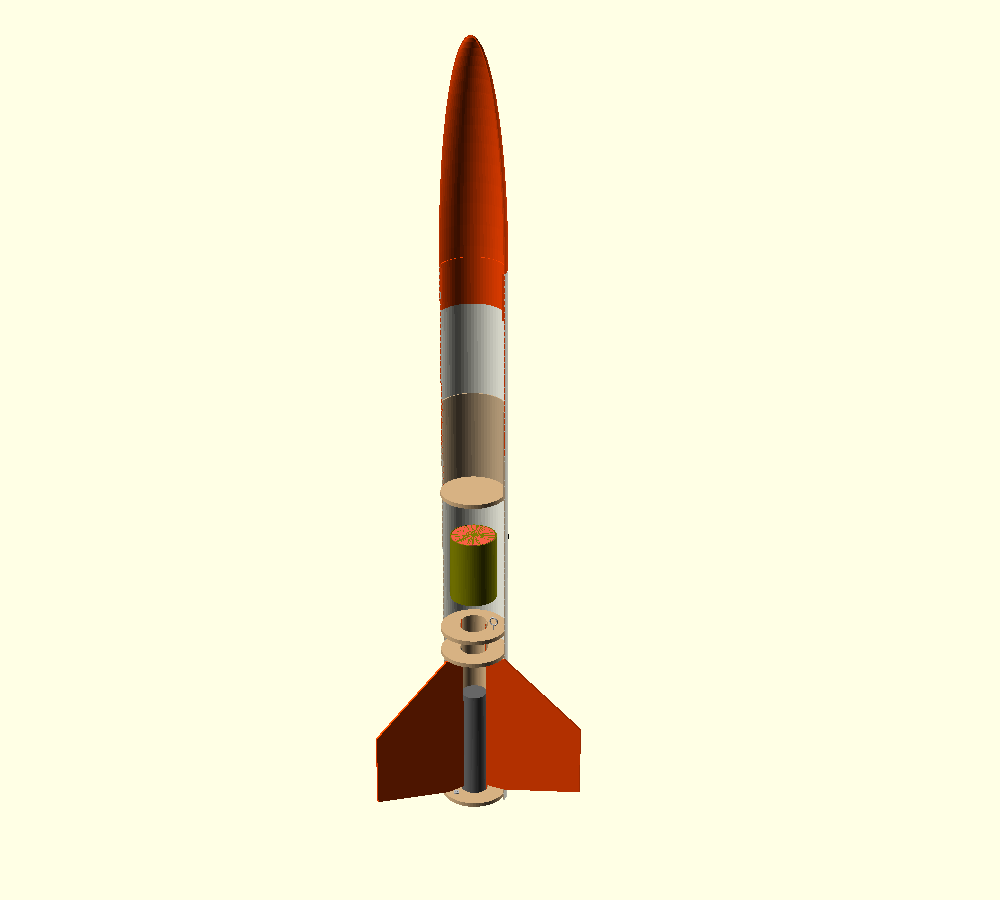

# Plans

**Projet et fusée : Chasse Galerie 1.** Base technique : kit LOC-IV 4 po. Les noms de fichiers `loc-iv-*` sont conservés pour maintenir les liens et la traçabilité des références.

Plans, schémas, fichiers sources et décisions. Préciser versions, unités, hypothèses et sources. Utiliser le [gabarit de plan](../modeles/plan.md).

**Première utilisation d'OpenSCAD ?** Suivre l'[aide à la tâche pour débuter et coder la LOC-IV](../aides-a-la-tache/debuter-openscad-loc-iv.md), avec des exercices expliqués pas à pas.

## Décoration du tube

Consulter le [cahier d’intention du décalque](../notes/chasse-galerie-1-decalque.md) : vinyle imprimé satiné, gabarits par section et essais prévus. Les [trois propositions visuelles](decalques/README.md) sont disponibles; **Le sillage fleurdelisé (02)** est retenu. Les [gabarits provisoires d’impression et l’habillage OpenRocket/OpenSCAD](decalques/sillage/README.md) sont disponibles aux cotes du plan; mesures réelles et qualité finale d’impression restent à valider.

## Images des pièces

La [galerie des composants](images/README.md) présente **18 images** dans [`plans/images`](images), avec les pièces isolées et les variantes de récupération. Chaque vue est cadrée séparément et accompagnée des limites du modèle. Les images se régénèrent avec le [script fourni](outils/generer-images.ps1).

## Modèle de simulation OpenRocket

L'[aide OpenRocket pour débutants](../aides-a-la-tache/debuter-openrocket-loc-iv.md) accompagne la construction et la simulation de la fusée complète, accessoires et récupération compris.

La [version OpenRocket de la LOC-IV](loc-iv-openrocket.md) propose un [fichier natif .ork](loc-iv-4po.ork), son [XML lisible](loc-iv-4po.xml) et quatre scénarios H143/H152. Les masses et conditions non mesurées restent des hypothèses; les essais d'éjection signalent un déploiement à grande vitesse. Voir le [rapport de vérification](loc-iv-openrocket-verification.md).

## LOC-IV 4 po — plan paramétrique v1.1

- **Date :** 2026-09-12
- **Statut :** brouillon — représentation d'ensemble, dimensions à valider sur le kit reçu.
- **Auteur :** Steve Prud’Homme, avec assistance Codex.
- **Fichier :** [loc-iv-4po.scad](loc-iv-4po.scad), sans bibliothèque externe.
- **Source principale :** [configuration et budget niveau 1](../notes/loc-iv-configuration-budget-niveau-1.md).



Aperçu généré avec OpenSCAD à partir des paramètres par défaut; géométries approchées selon les limites ci-dessous.

La révision 1.1 remplace les ailerons trapézoïdaux approximatifs par le profil libre et la languette du fichier LOC. Voir les [notes de comparaison et de correction](../notes/loc-iv-comparaison-modeles.md), la [fiche de mesures du kit](../notes/loc-iv-mesures-kit.md) et la [feuille de route](../ROADMAP.md). Les cotes de référence ne sont pas encore confirmées sur le kit réel.

Le modèle représente la configuration des notes : LOC-IV récente à support moteur 38 mm, Cesaroni Pro38 2G, H143 ou H152, MR-1, récupération et boutons 1010. Il comporte le booster à fentes, la section payload, un coupleur et sa cloison, une ogive creuse à épaulement, trois ailerons à languette, trois anneaux de centrage et les points d'attache schématiques. Le moteur est une enveloppe externe assemblée, pas un dessin du boîtier nu ni de ses composants internes. Le ProDAT-38 optionnel est un symbole séparé d'accessoire au sol.

Le fichier antérieur `LOC_IV_4in_v0.2.scad` n'a pas pu être récupéré depuis la conversation référencée (lecture indisponible). Cette version est une reconstruction; elle n'annonce pas une reprise ou une vérification de ce fichier.

### Unités, provenance et limites

Toutes les longueurs sont en **millimètres**, à l'échelle 1:1. L'origine est au bas du corps; l'axe Z pointe vers l'ogive. Les commentaires `[N]`, `[L]`, `[I]`, `[C]`, `[R]` renvoient aux sources ci-dessous. **`[A]` désigne une approximation à mesurer**, même si sa valeur comporte des décimales. Les couleurs sont indicatives.

| Paramètres | Base et statut |
| --- | --- |
| Corps 4 po, longueur totale 47 po; sections 23 et 11 po | Fiche LOC [L], nominal; diamètre extérieur réel à mesurer |
| Ogive exposée 330,2 mm | Différence des longueurs [L], pas une mesure directe; profil ellipsoïdal approché |
| Trois ailerons de 1/8 po, trois anneaux | Notice [I]; épaisseur des anneaux de 1/4 po : [L] |
| Profil, position et languette des ailerons | Fichier LOC [F], cinq sommets; coordonnées détaillées dans les notes; épaisseur 3,175 mm conservée malgré les 3 mm du fichier |
| Moteur 38 × 186 mm | Enveloppe assemblée H152/H143 [C], pages PDF 15 et 16 |
| Parachute 36 po, sangle 15 pi | Notes [N], confirmées par LOC; largeur de sangle 3/8 po : [L] |
| MR-1 à deux clips en Z | [I,R]; largeur 3/4 po [R]; forme, visserie et implantation approchées |
| Dépassement du support derrière/devant les anneaux | 1/8 po pour MR-1 et 1/4 po à l'avant, notice [I], page 2 |
| Autres cotes | `[A]` : parois/alésages, longueur du support, coupleur, cloison, épaulement, fixations, positions des anneaux et boutons, volumes textiles et ProDAT |

Le protecteur de **12 po est une proposition modifiable**, absente des notes. Le diamètre du bouton n'est pas déduit de « 1010 ». Les paramètres de jeux servent à la visualisation : ils ne constituent pas des tolérances de fabrication. La bague de poussée du moteur, les filetages, les congés d'époxy et les détails de couture sont omis. Aucune géométrie d'une rétention alternative n'est inventée : les options sont `MR-1` et `none`.

Ce modèle ne valide ni la résistance, ni l'ajustement réel, ni le centre de gravité, ni la stabilité, ni le volume de rangement. Les exports sont des maquettes de référence, pas des pièces de vol prêtes à fabriquer. Le choix de moteur et du délai reste à simuler avec la masse réelle, comme indiqué dans les notes.

Les ailerons dépassent maintenant de 34,925 mm derrière le corps : longueur avec ailerons 1228,725 mm, contre 1193,8 mm pour pointe/arrière du corps. Dans l'assemblage OpenSCAD uniquement, un recouvrement radial de 0,05 mm évite les contacts tangents non-manifold avec le tube. L'export `part="fin"` conserve les cotes exactes du profil; ce recouvrement n'est pas une cote de fabrication. La languette de référence et le support encore estimé présentent un jeu radial nominal de 0,128 mm, à résoudre par mesure.

### Paramètres et variantes

| Réglage | Valeurs / effet |
| --- | --- |
| `part` | `assembly` ou une pièce de la liste ci-dessous |
| `view` | `assembled`, `cutaway` (défaut : demi-enveloppes retirées côté Y négatif), `exploded` (sépare axialement payload et ogive) |
| `explosion_gap` | Espacement visuel en vue éclatée; ne modifie pas les pièces |
| `motor_preset` | `H143`, `H152`, `generic_2G`; couleur et identification seulement, même enveloppe |
| `retention` | `MR-1` ou `none`; ce dernier masque la retenue, sans valider un vol sans retenue |
| `recovery` | `packed` ou `deployed` : schéma explicatif à plat, pas une scène de descente calculée |
| `show_motor`, `show_recovery`, `show_protector`, `show_rail_buttons` | Visibilité dans l'assemblage |
| `show_prodat` | Affiche l'accessoire séparé; désactivé par défaut |
| `quality` | Résolution circulaire, 64 par défaut; minimum 12 |

Exports individuels avec `part` : `booster`, `payload`, `nose`, `coupler`, `bulkhead`, `fin`, `motor_mount`, `ring`, `motor`, `retainer`, `parachute`, `protector`, `cord`, `rail_button`, `prodat`, `eye` (point d'attache). Les pièces isolées sont dans leur repère local et complètes, indépendamment de `view`; `recovery` commande la forme des textiles. `retainer` avec `retention="none"` est volontairement vide. Les boutons de visibilité ne masquent pas les exports individuels.

La sangle rangée est un ruban schématique : le tracé ne développe pas les 4572 mm conservés dans `cord_l`. En mode déployé, les segments montrent les relations entre corps, payload et parachute; leurs longueurs ne sont pas celles de la sangle. La voile est un disque au diamètre nominal, avec des suspentes approximatives. Le protecteur rangé est une enveloppe indicative sans conservation de surface. Le modèle ne représente pas le double déploiement optionnel.

### Ouvrir, rendre et exporter

Ouvrir le fichier dans OpenSCAD, modifier les paramètres en tête ou dans le Customizer, puis utiliser **F5** pour l'aperçu et **F6** pour le rendu. Les couleurs sont visibles en aperçu; le STL ne les conserve pas. La vue éclatée sépare deux sous-ensembles, pas toutes les pièces; utiliser la coupe ou les exports individuels pour examiner l'intérieur.

Depuis la racine du dépôt, avec OpenSCAD dans le PATH :

```sh
openscad -o loc-iv-coupe.stl plans/loc-iv-4po.scad
openscad -o loc-iv-assemblee.stl -D 'view="assembled"' plans/loc-iv-4po.scad
openscad -o loc-iv-eclatee.stl -D 'view="exploded"' -D 'motor_preset="H152"' plans/loc-iv-4po.scad
openscad -o aileron.stl -D 'part="fin"' plans/loc-iv-4po.scad
openscad -o parachute.stl -D 'part="parachute"' -D 'recovery="deployed"' plans/loc-iv-4po.scad
```

Sous Windows PowerShell, remplacer `openscad` par `& 'C:/Program Files/OpenSCAD/openscad.com'` si nécessaire. Les STL sont des sorties générées; conserver le `.scad` comme source versionnée. L'assemblage contient plusieurs volumes : ce n'est pas un solide monobloc.

### Vérification effectuée

Historique v1.0 : 21 rendus STL avaient été testés avec OpenSCAD 2021.01 sous Windows. La révision 1.1 est vérifiée à nouveau sur les pièces affectées (aileron et booster à fentes), l'assemblage en coupe et l'aperçu actualisé. Les contrôles numériques ne confirment pas les cotes du kit réel. Les variantes non modifiées ne constituent pas une nouvelle campagne de 21 rendus.

### Points à vérifier sur le kit

1. Confirmer la version à sections 23/11 po et l'inventaire décrit dans les notes.
2. Mesurer diamètres/parois, support moteur, ailerons et languettes, coupleur, cloison et ogive.
3. Relever les positions des anneaux, points d'attache, clips et boutons, et leurs interfaces réelles.
4. Mesurer les textiles rangés et choisir le protecteur; remplacer les valeurs `[A]` avec provenance datée.
5. Vérifier les jeux et la géométrie après toute modification; les assertions ne contrôlent que quelques incohérences, pas toutes les collisions.

### Sources complémentaires

Consultées le 2026-09-12; elles complètent les notes sans modifier leur statut de brouillon.

- **[N]** [Notes de configuration et budget](../notes/loc-iv-configuration-budget-niveau-1.md).
- **[L]** [LOC Precision — LOC-IV](https://locprecision.com/products/loc-iv).
- **[I]** [Notice LOC-IV PK-48](https://cdn.shopify.com/s/files/1/0568/7489/3503/files/Loc_IV_Instructions-final.pdf?v=1747083020), nomenclature page 1, support et MR-1 page 2.
- **[C]** [Catalogue Cesaroni Pro38](https://pro38.com/wp-content/uploads/2024/11/Pro38Catalog.pdf), document interne « 2010 Catalog v1.0 » malgré le chemin daté 2024; pages PDF 15–16 pour les enveloppes H152/H143.
- **[R]** [LOC Precision — MR-1 Z Clip](https://locprecision.com/products/z-clip-style-motor-retainer-set/).
- **[F]** [Archive du fichier LOC PK-48 Loc-IV.rkt](https://cdn.shopify.com/s/files/1/0568/7489/3503/files/PK-48-Loc-IV-3.zip?v=1623759843), liée depuis [L]; empreinte et limites dans les notes de comparaison.

[Retour à l’accueil](../README.md)

## Plan d’ensemble avec vue écorchée

Le [dossier ensemble](ensemble/README.md) contient le PDF A3 de deux feuilles, les aperçus et les projections SVG. La source de mise en page est `outils/generer-plan-ensemble.py`. Les cotes estimées restent identifiées; le kit réel reste à mesurer.
