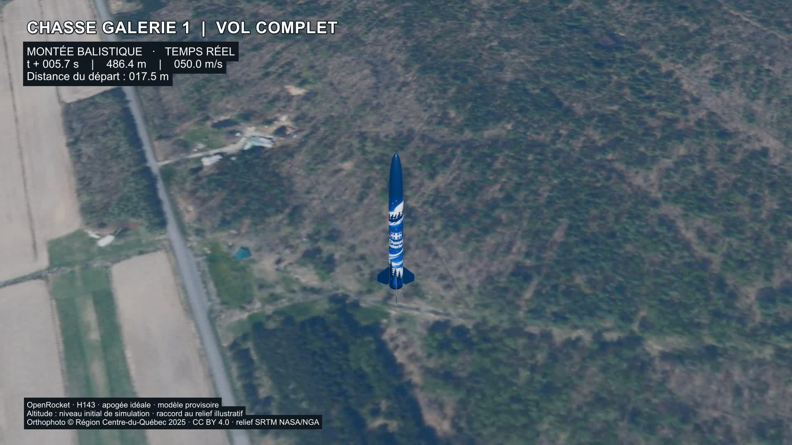

# Chasse Galerie 1 — Ombres et éclairage v7

Suite : [cinématographie et optique v8](../cinematographie/README.md), qui conserve cet éclairage.

Livraison locale du 6 octobre 2026. Les ombres fixes de l’orthophoto sont atténuées et le soleil Blender est orienté selon les ombres résiduelles observées près de l’intersection.

- [Vol complet MP4](chasse-galerie-1-vol-complet.mp4) : 1080p, 30 images/s, 40,57 s, sans son.
- [Démonstration de l’éclairage](extrait-eclairage.mp4) : 8 s.
- [Scène Blender autonome](chasse-galerie-1-eclairage.blend).
- [Comparaison de l’orthophoto avant/après](comparaison-orthophoto.jpg) et [repères d’estimation des ombres](mesures-ombres.png).
- [Projet de correction dans le compositeur Blender](correction-orthophoto.blend), avec l’image source intégrée et les nœuds modifiables.

## Atténuation des ombres photographiques

La correction est réalisée dans le **compositeur de Blender 4.3**, utilisé comme logiciel d’édition graphique. Elle conserve les 5 000 × 4 000 pixels de la mosaïque et ses coordonnées de texture. L’original reste intégré au projet de correction; aucune déformation géographique ni reconstruction de bâtiments n’est appliquée.

Un masque continu sélectionne les tons sombres selon leur luminance en lumière linéaire, entre 0,008 et 0,085. Le gain augmente progressivement jusqu’à 1,75 pour les valeurs les plus basses. Les zones claires sont pratiquement inchangées : la variation au 99e percentile y reste d’un niveau sur 255. Dans les tons sombres contrôlés, la luminance linéaire augmente de 46 % en médiane; cela ne signifie pas une augmentation identique de la luminosité perçue.

Il s’agit d’une **atténuation**, pas d’un effacement complet des ombres. Le masque tonal peut aussi éclaircir des matériaux naturellement sombres. Il ne restitue pas de détails absents de la photographie. L’orthophoto corrigée est enregistrée en PNG, puis intégrée au matériau hybride de la scène de vol.

## Orientation du soleil

Trois repères visuels près des bâtiments ont été examinés sur une zone de l’orthophoto originale à 20 cm/pixel. Ils donnent une direction solaire moyenne d’environ **142° dans la grille MTM8**, convertie en **140,8° dans la grille UTM18 du terrain Blender**. Le soleil vient donc approximativement du sud-est; les ombres se projettent vers le nord-ouest, à 320,8° dans cette grille.

Cette estimation visuelle a une incertitude indicative de **±10°**. Les points de toiture et leurs ombres ne constituent pas un relevé topographique. L’élévation du soleil est fixée à **50° pour le rendu**, car la hauteur des bâtiments et l’heure exacte de prise de vue ne sont pas connues. L’accord concerne donc surtout l’orientation des ombres, sans prétendre reproduire exactement leur longueur ou les conditions d’acquisition de toutes les tuiles.

Une seule lumière solaire projette les ombres. Les ombres des éclairages d’appoint sont désactivées pour éviter des directions concurrentes. Le paramètre Blender **Angle**, diamètre apparent de la source, est réglé à 0,035 radian, soit environ 2°, pour adoucir les contours de façon illustrative.

Les paramètres, repères et limites sont archivés dans [eclairage.json](donnees/eclairage.json). L’alignement est une cohérence visuelle estimée, pas une reconstitution astronomique certifiée.

## Éléments conservés et vérifications

Le terrain hybride v6, son masque radial de 24 à 36 m, ses 9 260 chaumes, les mouvements de la fusée, la récupération et les appuis visuels restent conservés. Le pas de tir reste provisoire, à 80 m à l’ouest de l’intersection. Le raccord vertical au relief demeure illustratif, sans nouveau calcul OpenRocket.

Les contrôles portent sur la taille et les valeurs de la texture, la direction du soleil après réouverture du fichier, les 1 217 positions du vol, les 241 poses après contact et le décodage intégral des deux vidéos. L’écart maximal de trajectoire reste inférieur à 0,1 mm dans le repère visuel documenté; la garde minimale des éléments contrôlés après contact reste de 32 mm. Ces valeurs décrivent le modèle numérique, pas la précision du terrain réel.

Rapports : [correction de l’image](verification-correction.json), [éclairage](verification-eclairage.json), [vol et contacts](verification-vol-terrain.json), [vidéos](verification-video.json).

## Sources, droits et reproduction

Orthophoto : **© Région Centre-du-Québec, 2025**, distribuée par le MRNF / Gouvernement du Québec sous [CC BY 4.0](https://creativecommons.org/licenses/by/4.0/deed.fr), via le [portail officiel](https://imagerie-telechargement.portailcartographique.gouv.qc.ca/). Transformations : mosaïque RGB à 2 m/pixel préparée en v6, puis atténuation tonale des ombres en v7. Les URL et dates des tuiles figurent dans [la provenance](donnees/provenance-orthophotos.json).

Relief : NASA/NGA, SRTM GL1 v3, [DOI 10.5067/MEaSUREs/SRTM/SRTMGL1.003](https://doi.org/10.5067/MEaSUREs/SRTM/SRTMGL1.003), hébergement OpenTopography. Origine du site : © [contributeurs OpenStreetMap](https://www.openstreetmap.org/copyright), ODbL. Le modèle, la terre procédurale et les chaumes proviennent du projet Chasse Galerie 1, avec assistance Codex.

Le fichier de vol s’ouvre et se rend dans Blender 4.3 sans téléchargement de textures. Les scènes 03 et 04 correspondent respectivement au vol complet et à la démonstration. Pour reconstruire la correction, rendre le projet `correction-orthophoto.blend`, ou utiliser `corriger-orthophoto.py`; appliquer ensuite `appliquer-eclairage.py` à la scène v6. Les scripts conservent la structure locale `outputs/terrain-hybride-v6`, `outputs/eclairage-v7` et `work/eclairage-v7`. Les titres et l’encodage sont fournis dans `sources/`.

Les documents du projet ont été mis à jour avant le commit `e42b6cb`. Cette révision est publiée sur GitHub; présence distante vérifiée le 2026-10-06.
