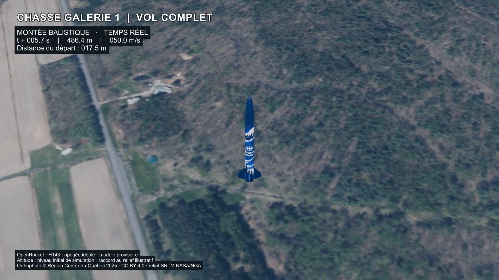

# Chasse Galerie 1 — Terrain hybride v6

**Version suivante disponible :** [ombres et éclairage v7](../eclairage/README.md), avec orthophoto atténuée et soleil orienté selon les ombres résiduelles. Cette notice conserve la description de sa révision historique.

Révision locale du 21 septembre 2026. Le vol complet utilise maintenant le relief géoréférencé et un matériau combinant imagerie aérienne, terre PBR et chaumes en 3D.

- [Vidéo complète](chasse-galerie-1-vol-complet.mp4) : 1080p, 30 images/s, 40,57 s, sans son.
- [Démonstration du terrain](extrait-terrain-hybride.mp4) : 8 s, du sol détaillé à la vue aérienne.
- [Scène Blender autonome](chasse-galerie-1-terrain-hybride.blend), [vue proche](apercu-detail.jpg), [transition](apercu-transition.jpg), [vue aérienne](apercu-aerien.jpg) et [masque de fusion](masque-fusion.png).

## Les trois éléments réalisés

| Élément | Réalisation |
| --- | --- |
| Vue globale | Orthophoto aérienne du Centre-du-Québec acquise au printemps 2025. Elle remplit le rôle de la texture satellite demandée, mais provient d’un avion. Vingt tuiles originales à 20 cm fournissent une mosaïque RGB de 5 000 × 4 000 pixels à 2 m/pixel, couvrant 10 × 8 km. |
| Vue détaillée | Terre procédurale PBR : agrégats d’environ 6 cm, microrelief de 1,5 mm, relief de mottes de 8 mm et rugosité variant de 0,78 à 0,98. Les grandes teintes de l’orthophoto sont conservées pour limiter la démarcation. 9 260 chaumes avec tiges et feuilles brisées complètent le sol autour du départ. |
| Transition | Distance horizontale au pas de tir en mètres, puis dégradé « Smoothstep » : détail maximal jusqu’à 24 m, moitié à 30 m, imagerie seule à partir de 36 m. Le même profil atténue la hauteur et la densité des chaumes. Le mélange reste fixe au sol, indépendamment de la caméra. |

Les textures de terre sont calculées à l’échelle physique par les nœuds Blender; elles ne dépendent pas d’une petite image répétée. Le relief apparent du matériau ne modifie pas les cotes du SRTM. Les chaumes sont une interprétation artistique d’un champ récolté, pas un relevé de la culture présente sur place.

## Coordonnées, relief et raccord du vol

L’origine reste l’intersection du rang Letendre et du 10e Rang : **46,004782° N, 72,7232675° O**, repère UTM 18N, EPSG:32618. L’image est reprojetée depuis NAD83(CSRS)/MTM 8, EPSG:2950, vers les coordonnées de texture du terrain.

Le pas de tir est placé **provisoirement à 80 m à l’ouest de l’intersection**, dans le champ : 46,0048026° N, 72,7242999° O. Ce point sert au rendu; il n’est ni mesuré ni confirmé comme emplacement réel. Les paramètres et les coordonnées sont conservés dans [terrain-hybride.json](donnees/terrain-hybride.json). Pour déplacer le site dans la construction, modifier le centre dans `preparer-hybride.py`, puis reconstruire le terrain, le masque, les chaumes et les ancrages ensemble; déplacer seulement la rampe ne recalcule pas ces éléments.

Le maillage SRTM natif de 57 200 sommets reste intact dans la scène de référence. Le maillage de rendu comporte **511 888 sommets**, obtenus par interpolation bilinéaire à trois subdivisions par intervalle natif : cela n’ajoute aucune précision mesurée. Deux surfaces d’appui visuelles de 16 m de rayon, fondues jusqu’à 32 m, permettent de conserver l’animation de départ et d’atterrissage. La modification maximale du relief interpolé est **0,548 m** dans ces zones.

La trajectoire OpenRocket v4, son vent de 2 m/s et ses CSV sont conservés. Ses X/Y sont translatés dans le repère du site. Un raccord visuel en Z entre les images 900 et 977 compense la différence de hauteur entre les deux appuis, **1,698 m**. Il s’agit d’une adaptation du rendu, pas d’un recalcul OpenRocket tenant compte du relief. Les altitudes affichées restent celles de la simulation initiale, mesurées au-dessus de son niveau de départ. Les huit secondes après contact restent une animation illustrative.

La caméra montre davantage le paysage pendant la montée et la descente. Un éclairage de jour facilite la lecture du sol. L’effacement des ombres présentes dans l’imagerie et l’alignement précis de l’éclairage sur ces ombres restent des tâches ultérieures. Les bâtiments et les arbres lointains restent des éléments de la texture, sans reconstruction en volume.

## Contenu du fichier Blender

1. **01 — Vol v4 de référence** : animation précédente conservée.
2. **02 — Site SRTM géoréférencé** : terrain natif v5 conservé.
3. **03 — Vol complet sur terrain hybride** : scène à rendre pour le MP4 complet, images 1 à 1217.
4. **04 — Inspection du terrain hybride** : survol de démonstration, images 1 à 240.

L’orthophoto et les autres textures utilisées sont intégrées au fichier. Aucun service cartographique ou module supplémentaire n’est nécessaire pour ouvrir la scène et la rendre dans Blender 4.3.

## Sources et droits

- **Orthophotographie : © Région Centre-du-Québec, 2025**, distribuée par le MRNF / Gouvernement du Québec, sous [licence CC BY 4.0](https://creativecommons.org/licenses/by/4.0/deed.fr). [Portail officiel de téléchargement](https://imagerie-telechargement.portailcartographique.gouv.qc.ca/) et [présentation de l’imagerie orthorectifiée](https://mrnf.gouv.qc.ca/repertoire-geographique/imagerie-orthorectifiee/).
- [Provenance des vingt tuiles](donnees/provenance-orthophotos.json) : URL originales, dates d’acquisition, licence et empreintes des textures intermédiaires. Transformation : conservation des trois canaux RGB, retrait de l’infrarouge, lecture d’une ligne sur dix et moyenne horizontale de dix pixels, assemblage puis compression JPEG. La mosaïque livrée n’est pas la résolution originale de mesure.
- Relief : NASA/NGA, *SRTM GL1 v3*, [DOI 10.5067/MEaSUREs/SRTM/SRTMGL1.003](https://doi.org/10.5067/MEaSUREs/SRTM/SRTMGL1.003), données hébergées par [OpenTopography](https://portal.opentopography.org/raster?opentopoID=OTSRTM.082015.4326.1).
- Origine géographique : © [contributeurs OpenStreetMap](https://www.openstreetmap.org/copyright), ODbL, nœud 540514913. Géoréférencement initial réalisé avec [BlenderGIS](https://github.com/domlysz/BlenderGIS).
- Terre procédurale, chaumes, assemblage et animation : projet Chasse Galerie 1, avec assistance Codex. Modèle de fusée provisoire.

## Reproduction et contrôles

Le fichier Blender livré suffit pour refaire les rendus. Les titres et crédits sont ajoutés avec FFmpeg; les scripts et le fichier ASS sont dans `sources/`.

Pour reconstruire les matériaux, les scripts utilisent la structure du travail local : `outputs/topographie-v5`, `outputs/vol-complet-v4`, `outputs/terrain-hybride-v6` et `work/terrain-hybride-v6`. Les chemins sont indiqués en tête des scripts. Python 3.12, NumPy, Pillow et pyproj préparent les données; Blender 4.3 crée et rend la scène. Avec les données préparées livrées, commencer à `creer-hybride.py` sur la scène v5, puis appliquer `finaliser-rendu.py` et `metadonnees-et-masque.py`. La préparation géographique complète est conservée séparément pour audit; elle n’est pas nécessaire au rendu de la scène autonome.

Les contrôles couvrent les 1 217 positions du vol et les 241 poses après contact. Écart maximal par rapport à la trajectoire translatée et au raccord Z documenté : **0,062 mm**. Les éléments contrôlés restent au-dessus de l’appui de retour, avec un minimum de **32 mm**. Ces écarts numériques ne représentent pas la précision réelle du terrain. Le SRTM natif de référence reste identique à moins de 0,2 mm, correspondant à la représentation numérique Blender.

Rapports : [matériau et maillage](verification-hybride.json), [trajectoire et contacts](verification-vol-terrain.json), [décodage des vidéos](verification-video.json).

Livraison et commit locaux. Cette révision n’est pas publiée sur GitHub.
