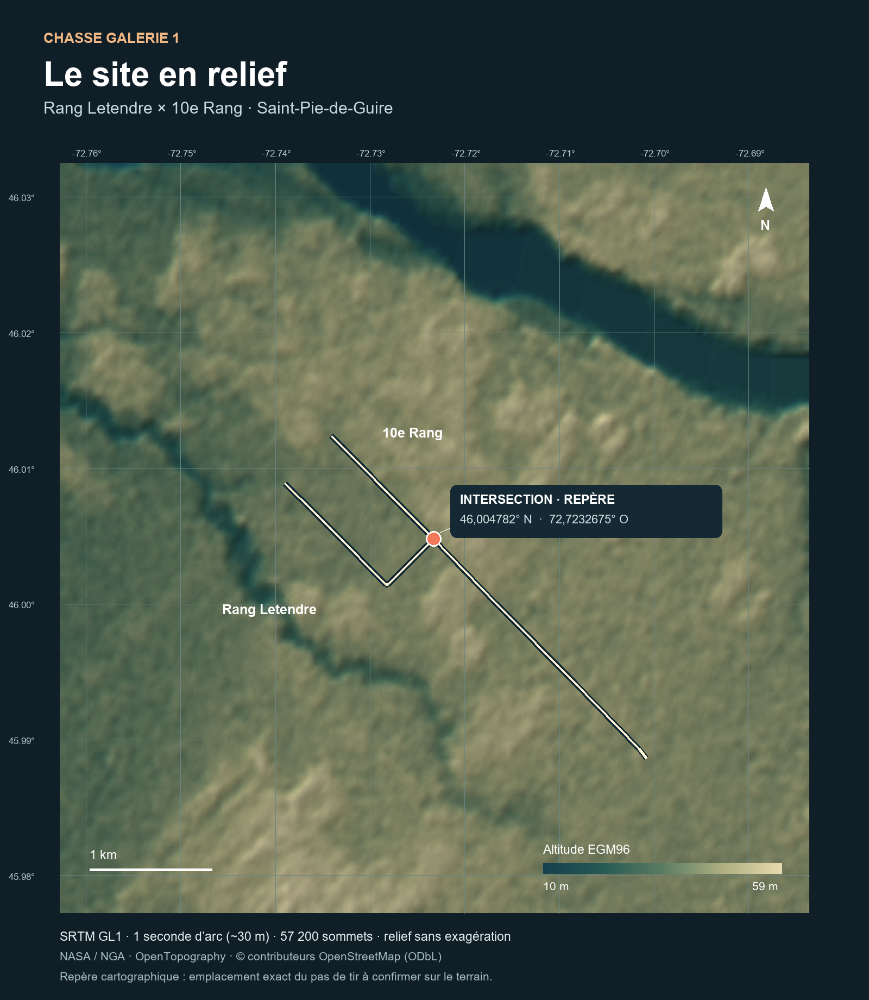

# Chasse Galerie 1 — Base topographique v5

**Livraison locale finalisée le 2026-09-20 (données téléchargées le 2026-09-17).** Intersection géoréférencée avec BlenderGIS et maillage natif SRTM GL1 à l’échelle réelle.

## Livrables

- [Scène Blender autonome](chasse-galerie-1-topographie.blend).
- [Survol topographique MP4](survol-topographique.mp4) : 8 secondes, 1080p, 30 images/s, sans son.
- [Carte de repérage](carte-topographique.png) et [aperçu 3D](apercu-topographie.png).
- [Raster GeoTIFF recadré](donnees/srtm-site-wgs84.tif), [coordonnées et routes GeoJSON](donnees/site.geojson), [métadonnées](donnees/georeferencement.json).
- [Vérifications](verification-topographie.json).

## Deux scènes dans le fichier Blender

**02 — Site SRTM géoréférencé** est la scène active à l’ouverture : terrain réel, axes des deux routes et marqueur de l’intersection. Les couleurs représentent l’altitude; aucune image satellite n’est encore appliquée.

**01 — Vol v4 de référence** conserve l’animation précédente, avec vent, fumée et récupération. Le survol livré ici présente le terrain seul. La vidéo complète reste en v4 : le raccord du vol avec le nouveau sol et les textures hybrides fera partie de l’intégration visuelle suivante. Les données de vol n’ont pas été recalculées sur ce relief.

## Coordonnées importées avec BlenderGIS

| Paramètre | Valeur |
|---|---|
| Latitude WGS84 | 46,004782° N |
| Longitude WGS84 | 72,7232675° O |
| Repère de la scène | WGS84 / UTM zone 18N — EPSG:32618 |
| Origine Est | 676 275,912 m |
| Origine Nord | 5 097 099,002 m |
| Altitude SRTM interpolée à l’origine | environ 46,2 m, référentiel EGM96 |
| Échelle Blender | 1 unité = 1 mètre |

Le [nœud OpenStreetMap 540514913](https://www.openstreetmap.org/node/540514913) est commun au [rang Letendre](https://www.openstreetmap.org/way/349408869) et au [10e Rang](https://www.openstreetmap.org/way/349408868). La [carte topographique du Québec 31I02-200-0102](https://diffusion.mern.gouv.qc.ca/diffusion/RGQ/Matriciel/Carte_Topo/Local/BDTQ/PDF/31i02102.pdf) confirme la configuration des deux routes. Les décimales servent à conserver le repère cartographique; elles ne constituent pas une mesure d’arpentage du pas de tir.

BlenderGIS **2.2.14** a été chargé localement pour définir le système de coordonnées et l’origine géographique. Ses propriétés de géoréférencement sont enregistrées dans la scène. Le module n’est pas nécessaire pour ouvrir ou rendre le fichier livré, et les préférences globales de Blender n’ont pas été modifiées.

## Maillage SRTM

Les tuiles **N45W073** et **N46W073**, fournies par NASA/NGA et hébergées par OpenTopography, ont été recadrées autour du site. Les échantillons natifs ont été projetés en UTM par les fonctions de BlenderGIS, puis importés comme sommets Blender.

- 200 lignes × 286 colonnes : **57 200 sommets et 56 715 faces**.
- Étendue d’environ **6,1 × 6,1 km**.
- Pas natif : **1 seconde d’arc**, soit environ **21,5 m Est–Ouest et 30,9 m Nord–Sud** à cette latitude.
- Altitudes du secteur : **10 à 59 m EGM96**; aucune exagération verticale.
- Aucun échantillon manquant; raccord des deux tuiles vérifié.
- Aucun lissage des valeurs d’altitude : seuls les normales du rendu sont lissés. La géométrie conserve les hauteurs natives.

SRTM est un modèle de surface radar acquis en février 2000. Sa maille d’environ 30 m ne garantit pas une précision verticale de 30 m ou une exactitude centimétrique. Elle ne décrit pas les fossés, les chaumes, les traces de roues ou les petites pentes du pas de tir. Le relief de base est géoréférencé; un relevé plus fin serait nécessaire pour reproduire ces détails mesurés.

Les routes sont des **axes cartographiques**, dessinés avec une largeur symbolique de 10 m pour être visibles dans le survol. Cette largeur et le marqueur rouge ne sont pas des objets mesurés. L’intersection constitue l’origine du projet, pas une validation de l’emplacement réel de lancement.

## Sources et attribution

- NASA JPL (2013), *NASA Shuttle Radar Topography Mission Global 1 arc second*, version 3, [DOI 10.5067/MEaSUREs/SRTM/SRTMGL1.003](https://doi.org/10.5067/MEaSUREs/SRTM/SRTMGL1.003).
- NASA / NGA, données hébergées par [OpenTopography — SRTM GL1 Global 30m](https://portal.opentopography.org/raster?opentopoID=OTSRTM.082015.4326.1); [politique d’attribution](https://opentopography.org/citations).
- © [contributeurs OpenStreetMap](https://www.openstreetmap.org/copyright), licence ODbL. Les réponses sources et les identifiants des routes sont archivés dans `donnees/`.
- [BlenderGIS](https://github.com/domlysz/BlenderGIS), domlysz, GPL-3.0; archive originale avec sa licence conservée dans `sources/BlenderGIS-original.zip`. [Documentation du géoréférencement](https://github.com/domlysz/BlenderGIS/wiki/Georeferencing-management).

Les URL des tuiles et leurs empreintes SHA-256 figurent dans les métadonnées. Les tuiles complètes restent dans le répertoire temporaire; le GeoTIFF recadré contient les données utiles au site.

## Reproduction

Depuis la racine du travail, télécharger les deux tuiles et l’archive officielle, puis lancer `preparer-module.py` pour extraire le module dans `work/topographie-v5/addons`. Cette préparation redirige uniquement le cache de BlenderGIS vers le travail local; aucune installation globale n’est requise.

Lancer `preparer-terrain.py` avec Python, NumPy et Pillow. Lancer ensuite Blender 4.3 sur la scène v4 avec `integrer-topographie.py`. Le script crée la nouvelle scène topographique, conserve la scène v4 et rend le survol. `carte-site.py` produit la carte; `livrer-topographie.py` encode la vidéo avec FFmpeg. Les chemins de travail sont regroupés au début des scripts.

## Contrôles

L’origine géographique, le repère UTM, les dimensions du raster, l’absence de valeurs manquantes et le raccord des tuiles ont été vérifiés. Les coordonnées du maillage diffèrent des données de préparation de moins de 0,2 mm, uniquement en raison de la représentation numérique de Blender; cela ne représente pas la précision des données SRTM. Les 240 images du MP4 se décodent sans erreur.

Le fichier Blender a été rouvert et contrôlé : [rapport de réouverture](verification-reouverture.json). Les textures de la scène v4 sont intégrées au fichier.
