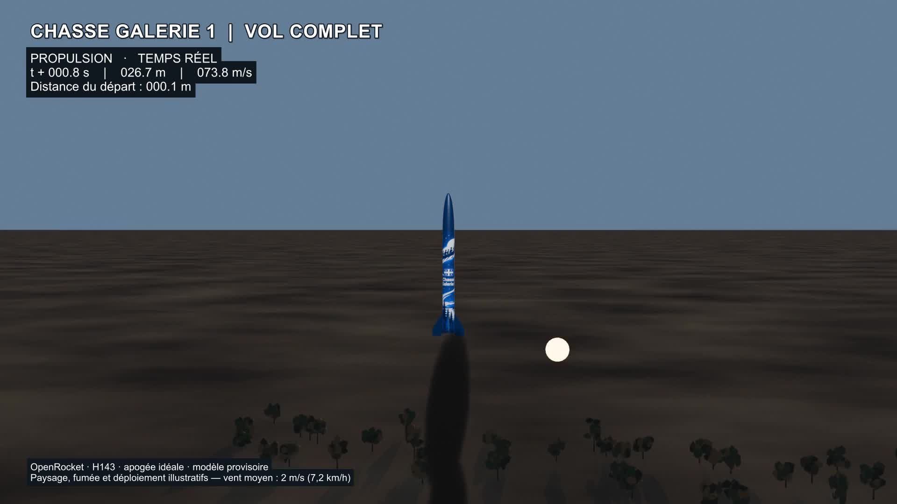

# Chasse Galerie 1 — Vent et fumée volumétrique v4

**Révision du 2026-09-17.** Vent léger calculé dans OpenRocket et nouveau panache volumétrique animé dans Blender 4.3.

- [Vidéo complète](chasse-galerie-1-vol-complet.mp4) : 1080p, 30 images/s, 40,57 secondes, sans son.
- [Extrait du moteur et de la fumée](extrait-atmosphere.mp4).
- [Extrait de l’atterrissage](extrait-atterrissage.mp4).
- [Scène Blender modifiable](chasse-galerie-1-vol-complet.blend).
- [Trajectoire OpenRocket](vol-h143.csv) et [événements](evenements-h143.csv).

## Vent et dérive

Le scénario H143 à récupération idéale à l’apogée a été recalculé avec un vent moyen de **2 m/s (7,2 km/h)**, une intensité de turbulence de **10 %**, une direction OpenRocket de 90° et le paramètre de graine de simulation 20260912. Il s’agit d’une hypothèse de démonstration, pas d’un relevé météo du site.

L’apogée atteint **592,645 m**, la récupération intervient à **10,195 s** et le contact à **106,682 s**. La position finale vaut **x = −163,759 m, y = −0,015 m**, soit environ 164 m du départ dans le repère de la simulation. La caméra suit cette nouvelle trajectoire. Un deuxième secteur de sol détaillé couvre la zone de retour; le décor reste illustratif et n’est pas géoréférencé.

Le montage conserve 1 217 images. Les instants physiques sont raccordés aux étapes du montage précédent; le facteur de lecture est indiqué à l’écran. Le gonflage conserve ses 1,5 seconde et les huit secondes après contact restent une animation visuelle sans télémétrie de vol.

## Fumée volumétrique

Les anciennes formes opaques sont remplacées par **116 particules à matériau volumétrique**, émises uniquement pendant les 1,73 seconde de combustion. Chaque volume naît à la position du moteur, reste indépendant de la fusée, puis se déplace sous un vent moyen dirigé vers −X. L’entraînement par le vent est progressif.

Un bruit tridimensionnel évoluant dans le temps module la densité. Les volumes grossissent, subissent des déplacements tourbillonnaires et une légère ascension, puis leur densité diminue jusqu’à disparition après sept secondes. Une atténuation près de leur bord évite une coque opaque. Toutes les animations et les matériaux sont intégrés à la scène, sans cache externe.

**Portée :** le vent et la trajectoire sont calculés par OpenRocket. La dispersion et les turbulences de la fumée sont procédurales et artistiques; ce n’est pas un calcul de mécanique des fluides validé. Le vent des particules reprend la moyenne du scénario, sans reproduire chaque fluctuation du modèle OpenRocket. La fusée et la récupération restent provisoires.

## Améliorations conservées

- Gonflage progressif sur 1,5 seconde et corde issue du solveur Soft Body de Blender.
- Pendule, léger lacet et mouvement secondaire de la section avant.
- Contact amorti, basculement des deux sections et parachute affaissé sur 4,4 secondes.
- Cordes avec mou et contrainte géométrique au-dessus du terrain.

Le balancement, l’impact et le dégonflage sont des animations illustratives, pas des prédictions de charges ou de dommages.

## Reproduction

Les sources v1 à v3 sont conservées. `ExporterVent.java` recharge le fichier OpenRocket du projet et exporte la nouvelle trajectoire. `animer-atmosphere.py` se lance depuis la racine de l’espace de travail sur la scène v3; il attend la trajectoire dans `outputs/vol-complet-v4` et écrit les rendus temporaires dans `work/atmosphere-v4`. La scène v4 livrée est autonome pour le rendu.

Rendre les images 1 à 1217, générer les sous-titres avec `titres-vol.py`, puis encoder en H.264/yuv420p avec FFmpeg et le filtre ASS. Les titres sont ajoutés à l’encodage, pas dans Blender.

## Vérifications de la livraison

Les 1 217 positions ont été comparées à la télémétrie : écart maximal inférieur à 0,1 mm. Les 116 volumes ont été contrôlés pour leurs instants d’émission, leur déplacement indépendant, leur croissance et leur disparition. Les contrôles de récupération et d’atterrissage sur 317 poses restent réussis : attaches à moins de 0,1 mm et aucune pénétration du terrain.

Rapports : [atmosphère](verification-atmosphere.json), [atterrissage](verification-atterrissage.json).

Pour reproduire exactement les matériaux et le cadrage finaux, appliquer également `fix-vol.py` puis `renforcer-fumee.py` sur la scène v4 générée, avant le rendu. Appliquer ensuite `diluer-fumee.py` pour l’atténuation de densité liée à l’expansion. La passe `attente-sans-fumee.py` fixe explicitement l’absence d’émission avant l’allumage. Ces passes règlent les coordonnées des volumes, leur densité et le cadrage plus large du décollage.

Le CSV livré constitue la référence exacte de cette animation. Dans OpenRocket 24.12, le paramètre de graine de simulation ne réinitialise pas la graine interne du modèle de vent déjà créé : une nouvelle exécution de l’exporteur peut donc produire de légères variations. Un second calcul de contrôle a donné 592,542 m d’apogée contre 592,645 m pour les données livrées. Le rendu Blender est reproductible à partir du CSV archivé.

## Version suivante — terrain hybride v6

Cette notice décrit la vidéo v4 conservée comme référence. La [vidéo complète v6](../terrain-hybride/README.md) intègre maintenant le relief SRTM, une orthophoto aérienne 2025, la terre PBR et les chaumes avec fondu radial. Les appuis et le raccord vertical au relief sont visuels et documentés. Les versions v2 à v6 restent locales, sans publication GitHub.
