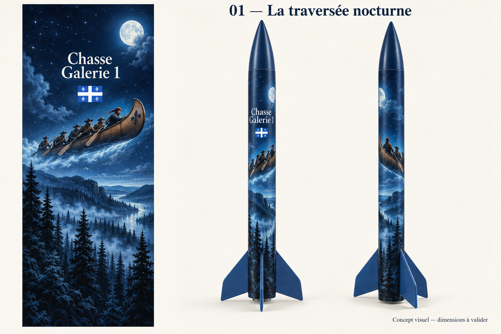
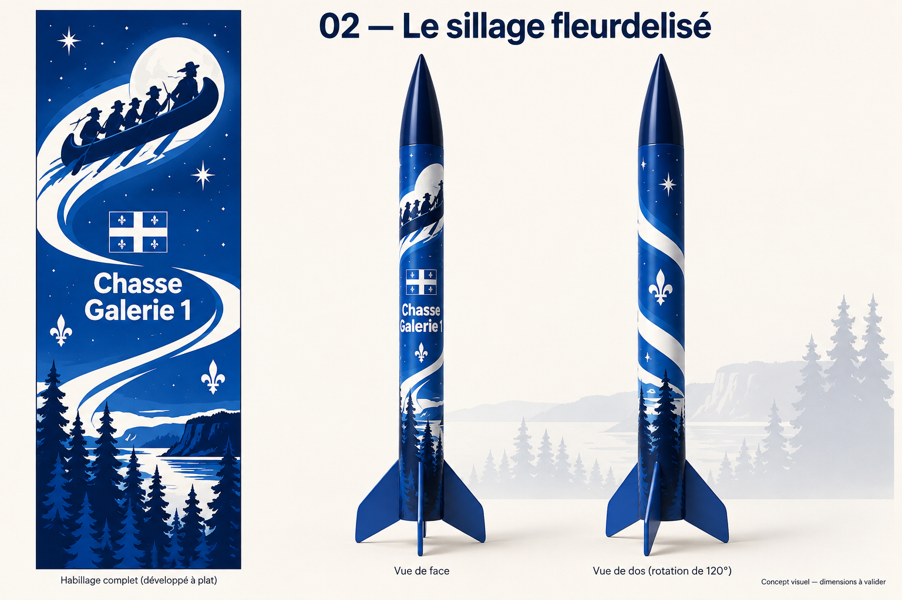
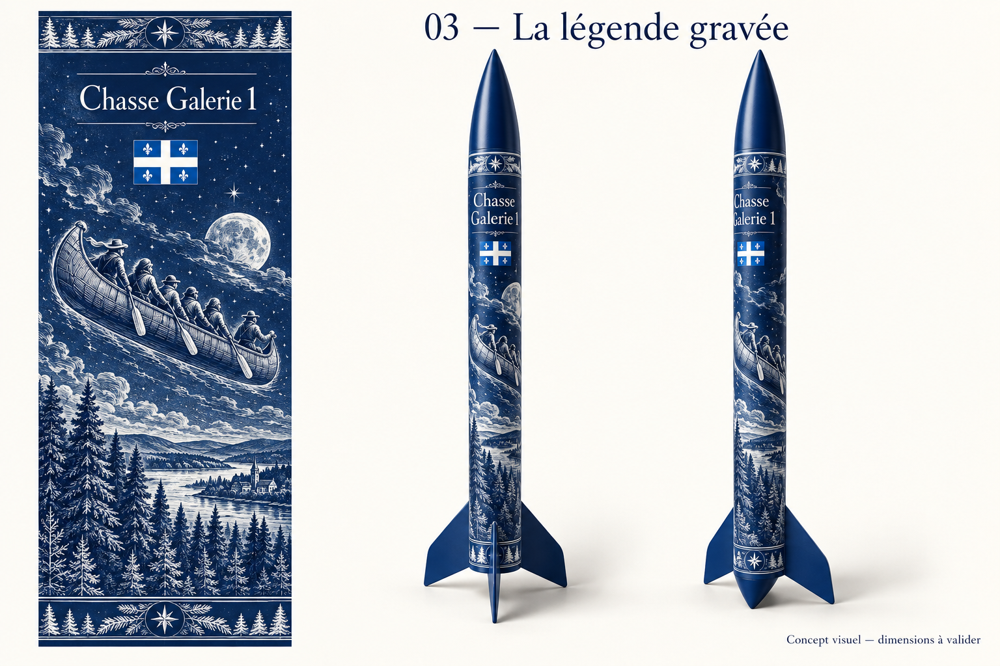

# Décalque Chasse Galerie 1 — Trois propositions

- **Date :** 2026-09-13
- **Statut :** **proposition 02 — Le sillage fleurdelisé retenue par Steve le 2026-09-13**; adaptation technique et fichier final pour impression à produire.
- **Méthode :** images originales générées avec l'outil intégré `image_gen`; [prompts complets](prompts-generation.md) conservés. Aucun visuel tiers fourni comme référence.
- **Intention :** [habillage en vinyle imprimé satiné](../../notes/chasse-galerie-1-decalque.md), thème chasse-galerie et drapeau du Québec.

Le design retenu associe le canot en silhouette, le sillage blanc, les fleurs de lys, le drapeau du Québec et le nom **Chasse Galerie 1** sur fond bleu. Les propositions 01 et 03 sont conservées comme historique de conception.

Chaque planche présente une composition à plat et deux mises en situation sur une fusée. Elles servent à comparer le style et la disposition du nom et des motifs.

## 01 — La traversée nocturne

Illustration narrative détaillée : bleu nuit, lune, brume, canot et forêt. Le nom et le drapeau occupent le haut du corps; le canot traverse le milieu en diagonale et le paysage descend jusqu'aux ailerons. Proposition exploratoire non retenue. Vérifier sur épreuve que les détails sombres restent lisibles.

## 02 — Le sillage fleurdelisé — Design retenu

Composition graphique plus contrastée : canot en haut, drapeau et nom au centre, sillage blanc qui tourne autour du tube, fleurs de lys et forêt en bas. Cette piste privilégie la lecture à distance. Le raccord du ruban entre les bords du développé sera à construire précisément.

## 03 — La légende gravée

Traitement de conte illustré : gravure blanche sur bleu, nom et drapeau en haut, canot au milieu, forêt et village au bas, frises aux extrémités. Cette piste met l'accent sur le folklore et les détails à observer de près. Tester la finesse des traits à la taille réelle d'impression.

## Limites des planches et prochaine étape

Ces images **ne sont pas des rendus du modèle SCAD ni des patrons d'impression**. Les proportions, ailerons, extrémités, raccords et angles des deux fusées sont illustratifs et peuvent différer du kit. En particulier, la mention d'angle sur la planche 02 n'est pas une vue géométrique vérifiée; l'extrémité arrière de la planche 03 n'est pas une proposition de modification de structure. Aucun changement de géométrie n'est prévu.

Les textes et motifs sont visibles, mais les caractères et les fleurs de lys devront être reconstruits ou contrôlés dans le fichier final; le drapeau devra avoir ses proportions et ses quatre fleurs de lys correctes. Les deux mises en situation ne constituent pas une projection exacte et reproductible du panneau à plat.

Suite au choix de Steve :

1. Utiliser la proposition 02 comme référence artistique pour la réalisation; conserver le canot, le sillage blanc, les fleurs de lys, le drapeau et le nom.
2. Mesurer les sections finies et les obstacles, puis préparer les gabarits papier.
3. Recomposer le design choisi dans une source modifiable, avec texte net, drapeau fidèle, raccord longitudinal et séparation des sections.
4. Produire le fichier à l'échelle demandé par l'imprimeur, puis une épreuve et un échantillon d'adhérence.
5. Préparer séparément les textures et leur application aux modèles, selon la faisabilité logicielle vérifiée.

Les PNG de cette galerie sont les livrables de conception actuels. Aucun prix, choix de fournisseur, essai de pose ou validation de texture n'est associé à ces images.

[Plans](../README.md) · [Feuille de route](../../ROADMAP.md)
