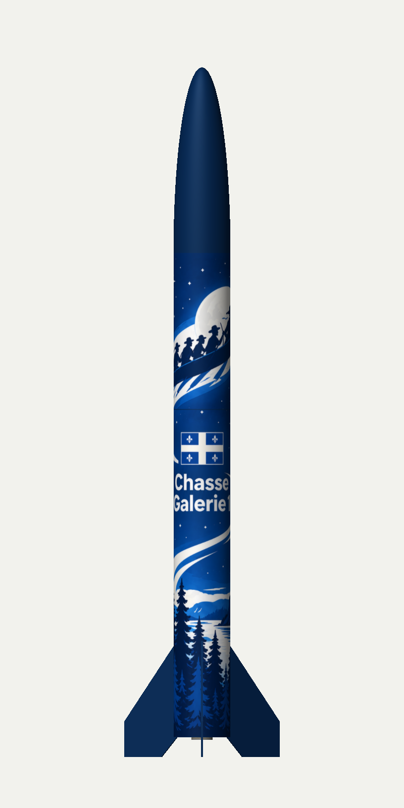
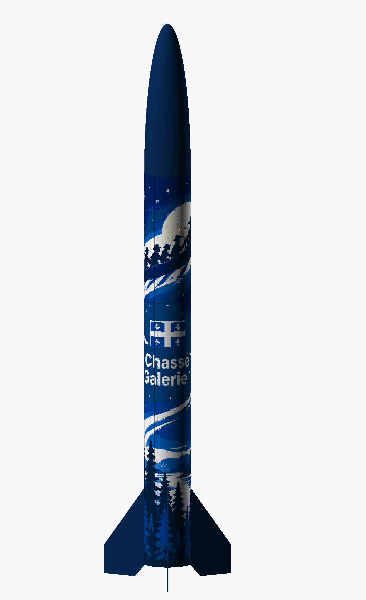

# Le sillage fleurdelisé - Gabarits et habillage 3D

**Révision P1, 2026-09-14 - PROVISOIRE, aux cotes du plan.** Steve a indiqué que le tube n'est pas fini et demandé de se fier au plan. Aucune mesure physique n'est présentée comme acquise. Cette livraison adapte le concept choisi et prépare les raccords; ce n'est pas un bon à tirer de fabrication.

## Ouvrir les résultats

| Besoin | Fichier |
| --- | --- |
| Essayer les dimensions sur papier | [Épreuve PDF à l'échelle 1:1, deux pages](epreuve-gabarits-provisoires.pdf) |
| Panneau haut avec fonds perdus, sans guides | [SVG payload](panneau-payload.svg) |
| Panneau bas avec fonds perdus, sans guides | [SVG booster](panneau-booster.svg) |
| Voir la fusée texturée et conserver les simulations | [Fichier OpenRocket autonome](chasse-galerie-1-sillage.ork) |
| Examiner le même décor dans OpenSCAD | [Aperçu OpenSCAD](chasse-galerie-1-sillage.scad), à conserver avec [la mosaïque](mosaique-generee.scad) |
| Régler et régénérer | [Configuration](configuration.json), [générateur Python](../../outils/generer-sillage.py) |

Le SVG est un **document contenant une illustration bitmap**, avec bandes et fondus vectoriels. Ce n'est pas une vectorisation du canot, du texte ou du drapeau.

## Dimensions et raccords

Source géométrique : [SCAD LOC-IV v1.1](../../loc-iv-4po.scad). L'empreinte du fichier utilisé est dans [dimensions-generees.json](dimensions-generees.json).

| Cote | Haut : payload | Bas : booster |
| --- | ---: | ---: |
| Longueur nominale du tube | 279,4 mm | 584,2 mm |
| Circonférence calculée : pi × 101,6 mm | 319,186 mm | 319,186 mm |
| Taille de coupe du panneau | 324,186 × 278,4 mm | 324,186 × 583,2 mm |
| Document SVG, fonds perdus compris | 330,186 × 284,4 mm | 330,186 × 589,2 mm |

Choix de maquette à confirmer avec le poseur : **5 mm de chevauchement**, **3 mm de fond perdu** autour du panneau et **0,5 mm de retrait à chaque extrémité** du tube. À la jonction entre tubes, les deux retraits laissent donc 1 mm de peinture visible. Le fond perdu est coupé; il ne s'ajoute pas au chevauchement posé.

Le développé global mesure 319,186 × 863,6 mm. Son origine est en haut du tube payload, juste sous l'ogive. Les deux panneaux sont des fenêtres du même dessin; le canot reste en haut, le drapeau et le nom sur le booster. On ne redimensionne pas séparément le contenu de chaque panneau.

Le raccord longitudinal est à **60 degrés dans le repère SCAD**, du côté des deux boutons de rail. Le bord gauche marque cette ligne; le bord droit dépasse d'un tour plus 5 mm et recouvre le début. Les 8 mm à chaque bord du tour sont bleu uni, avec un fondu supplémentaire de 4 mm vers le dessin. Le chevauchement reste ainsi dans une zone unie, sans canot, texte ou fleur de lys coupés. Le fichier répète le début du tour dans le recouvrement; les fonds perdus latéraux sont périodiques eux aussi.

Les guides orange du PDF indiquent uniquement les positions du plan : axes d'ailerons à 0/120/240 degrés, racine sur 171,45 mm depuis l'arrière; boutons à z = 70 et 430 mm, diamètre illustratif 12 mm. **Ce ne sont pas des contours de découpe.** Les congés, vis et jeux réels restent à relever. Les guides magenta montrent la coupe et la limite du tour. Aucun guide ne figure dans les SVG ni les textures.

## Épreuve et préparation de l'impression

1. Ouvrir le PDF et imprimer à **100 % / taille réelle**, sans ajuster à la page. Les pages sont plus grandes qu'une feuille A4 ou Lettre : utiliser un traceur ou le mode affiche/mosaïque du lecteur PDF, avec chevauchement de papier.
2. Mesurer la barre de contrôle de 100 mm avant de découper. Ne pas confondre le chevauchement des feuilles de papier avec les 5 mm de recouvrement du vinyle.
3. Découper sur le cadre magenta extérieur, enlever les fonds perdus et essayer chaque panneau. Le canot est sur la section haute; le nom est sur la section basse. Aligner les débuts de tour du côté du rail.
4. Contrôler la séparation des sections et les obstacles. Préparer les évidements sur le gabarit papier, pas en suivant aveuglément les cercles ou axes du modèle.
5. Après finition du tube, mesurer les circonférences et longueurs à couvrir, mettre à jour les modèles puis régénérer les gabarits.
6. Faire valider par l'imprimeur le chevauchement, les retraits, les fonds perdus, le vinyle et le laminage satiné, ainsi que son format et son profil couleur demandés.

**Limite de l'illustration :** la source reçue de la génération d'images mesure 763 × 2062 pixels, soit environ **61 ppp** aux dimensions du tube. Les textures rendues plus grandes n'ajoutent pas de détails. Elles conviennent à la maquette numérique et à une épreuve de placement; pour la finition finale, reconstruire au minimum le texte et le drapeau proprement, et fournir une illustration suffisamment définie pour l'exigence de l'imprimeur. À titre de calcul, 150 ppp sur le développé demanderaient environ 1885 × 5100 pixels utiles. Les couleurs de cette livraison sont RVB, sans profil de presse ni validation colorimétrique. Ne pas commander le vinyle final directement depuis ces fichiers provisoires.

## OpenRocket 24.12 : texture native



1. Télécharger le fichier `.ork` et l'ouvrir dans OpenRocket 24.12. Les deux images sont **intégrées à l'archive** : aucun chemin vers l'ordinateur de Steve n'est nécessaire.
2. Sélectionner la vue **3D Finished / 3D avec finition**, puis tourner la fusée pour examiner le nom et le côté du rail. Le [rendu du raccord](apercu-openrocket-1.png) montre la bande arrière.
3. Pour examiner les réglages, double-cliquer la section payload ou booster, puis ouvrir **Appearance / Apparence**. Le décor remplace l'apparence par défaut. L'ogive et les ailerons sont bleu uni.
4. Les paramètres de fichier sont identiques pour les deux sections : rotation 0 radian, échelle U/V = 1/1, décalage U = 1/6 et V = 0, mode `REPEAT`. Ce décalage place le raccord sur les boutons, en tenant compte de l'inversion interne d'OpenRocket. Conserver ces valeurs pour garder l'alignement.
5. Chaque texture correspond à un tour et à la longueur entière de sa section, avec les retraits d'extrémité représentés en bleu. Il ne faut **pas** importer le SVG de coupe ou sa largeur de chevauchement comme texture.

Textures séparées : [payload](texture-payload.png), [booster](texture-booster.png), [corps complet](texture-corps.png). Le [XML lisible](chasse-galerie-1-sillage.xml) utilise les images dans `decals/`; garder ce dossier à côté si l'on ouvre le XML seul. Préférer l'archive `.ork`.

La comparaison XML confirme que **seules les apparences changent** : géométrie, masses, matériaux, finition aérodynamique, moteurs et quatre scénarios sont identiques au modèle de base. Les simulations n'ont pas été recalculées pour un changement visuel. La masse réelle du vinyle et du laminage n'est pas encore incorporée; peser la fusée finie et réconcilier la masse de finition déjà estimée.

## OpenSCAD 2021.01 : mosaïque de couleurs



1. Conserver les deux fichiers `.scad` ensemble, ouvrir `chasse-galerie-1-sillage.scad`, puis appuyer sur **F5**.
2. Tourner et agrandir la vue pour examiner le motif et la jonction. Le [côté du raccord](apercu-scad.png) montre les boutons.
3. Ce logiciel ne propose pas ici de placage bitmap UV natif. Le générateur transforme donc le document en **44 288 tesselles de 74 couleurs**, sur une grille 128 × 346. C'est une approximation pixellisée du même décor, pas un décalque physiquement construit en relief.
4. Les tesselles sont décalées de 0,05 à 0,15 mm au-dessus de la peau uniquement pour l'affichage. Ne pas utiliser leurs dimensions ou leur volume comme matériau de vol. Le modèle reprend les modules du SCAD du projet, pas les silhouettes des propositions artistiques.
5. Utiliser F5 pour la couleur. **F6/STL ne conservent pas une texture d'image** et ne sont pas la voie d'export du décalque. Pour la texture détaillée, utiliser OpenRocket ou réutiliser les PNG dans un logiciel avec placage UV.

## Régénérer après une correction

Le fichier `configuration.json` centralise recouvrement, fonds perdus, retraits, bande de raccord, angle et résolution de la mosaïque. Les champs de mesure restent `null`; le générateur lit les cotes du SCAD. Si des mesures nouvelles sont saisies, mettre d'abord à jour les deux modèles de base : le générateur refuse une divergence de dimensions SCAD/ORK au lieu de déformer silencieusement une seule version. Des circonférences différentes entre les sections demanderaient d'étendre le générateur et de refaire les raccords.

Depuis la racine du dépôt, avec Python et les dépendances `Pillow`, `reportlab`, `pypdfium2`, `pypdf` :

```text
python plans/outils/generer-sillage.py
python plans/outils/verifier-sillage.py
```

Cette commande régénère les sorties de cette révision. Remplacer l'illustration source uniquement après archivage de la version précédente. Le [prompt d'adaptation](prompt-adaptation.md) et la [source bitmap](illustration-source.png) sont conservés. Le texte et le drapeau sont encore dans cette image; modifier le JSON ne les vectorise pas.

## Vérifications et sources

- PDF : deux pages rendues et inspectées; dimensions de page et repère de 100 mm contrôlés.
- PNG : bords gauche/droit identiques sur toute la hauteur, vérifiés automatiquement.
- OR : archive autonome, deux textures lues sans avertissement par OpenRocket 24.12; vues ci-dessus rendues par son moteur natif. Géométrie et données de simulation comparées au fichier de base.
- SCAD 2021.01 : compilation en CSG et deux aperçus PNG réussis. Aucun essai de fabrication ou F6 du décor revendiqué.
- Code de contrôle conservé : [Python](../../outils/verifier-sillage.py), [chargement et rendu natif OpenRocket en Java](../../outils/VerifierSillage.java).

Sources consultées le 2026-09-14 : [apparence et texture OpenRocket](https://openrocket.readthedocs.io/en/latest/setup/getting_started.html), [format de fichier OpenRocket](https://openrocket.readthedocs.io/en/latest/dev_guide/file_specification.html), [langage OpenSCAD](https://openscad.org/cheatsheet/), [fonction surface : conversion en hauteur, pas texture couleur](https://files.openscad.org/documentation/manual/Importing_Geometry.html). Les paramètres de rendu ont également été vérifiés dans les sources locales d'OpenRocket 24.12 : `AppearanceHandler`, `RocketComponentSaver`, `RealisticRenderer` et `RocketFigure3d.setupView`.

[Propositions et choix](../README.md) · [Note de décoration](../../../notes/chasse-galerie-1-decalque.md) · [Feuille de route](../../../ROADMAP.md)
