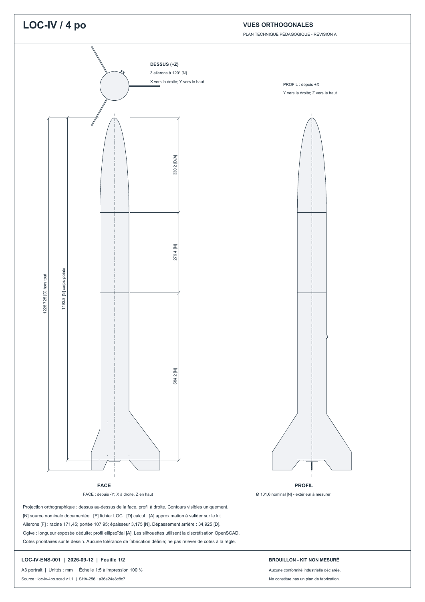
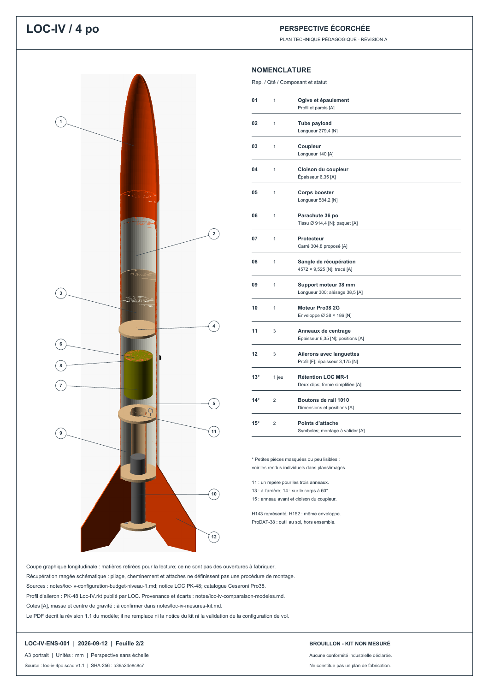

# Plan d'ensemble LOC-IV avec vue écorchée

[Ouvrir le PDF A3, révision A](loc-iv-plan-ensemble.pdf).

Ce document pédagogique complète le [modèle paramétrique](../README.md). Il décrit sa révision 1.1, avec les ailerons issus du fichier LOC, et conserve les approximations signalées dans le code. Ce n'est pas un dessin de définition pour fabrication et aucune conformité à une norme industrielle n'est déclarée.

- **Feuille 1 :** face, profil et dessus orthographiques, à 1:5 sur A3 imprimé à 100 %, jonctions des tubes, axes et cotes d'ensemble. Z pointe vers l'ogive; face depuis -Y, profil depuis +X, dessus depuis +Z. Les contours sont issus d'OpenSCAD; les arêtes cachées ne sont pas dessinées.
- **Feuille 2 :** perspective écorchée sans échelle, repérage et nomenclature de 15 familles de composants. Les petites pièces masquées sont localisées en texte et disponibles dans la [galerie](../images/README.md).




## Cotes et limites

`[N]` désigne une valeur nominale documentée, `[F]` une valeur du fichier LOC, `[D]` un calcul et `[A]` une approximation à mesurer. Ces abréviations sont propres au dessin; le code OpenSCAD conserve ses références détaillées `[L,I,C,R,F,A]`.

La longueur nominale corps-pointe est 1193,8 mm. Le dépassement des ailerons du modèle ajoute 34,925 mm, soit 1228,725 mm hors tout. Les décimales décrivent le calcul, pas une précision de fabrication. L'ogive ellipsoïdale, les parois, le support, le coupleur, les positions et les textiles restent partiellement estimés. Les coupes sont uniquement graphiques. La sangle rangée ne décrit pas son cheminement fonctionnel complet.

Les éléments de capsule/octogone évoqués dans la feuille de route ne sont pas intégrés : aucune telle variante n'est documentée pour cette LOC-IV. Une éventuelle variante reste à préciser.

Source principale : [configuration et budget](../../notes/loc-iv-configuration-budget-niveau-1.md). Voir aussi la [comparaison des références](../../notes/loc-iv-comparaison-modeles.md) et la [fiche de mesures encore à renseigner](../../notes/loc-iv-mesures-kit.md). La masse et le CG du kit ne sont pas confirmés.

## Régénération

Prérequis : Python avec `reportlab` et `Pillow`, et OpenSCAD (vérifié avec 2021.01). Depuis la racine du dépôt :

```powershell
python plans/outils/generer-plan-ensemble.py --render
# Chemin différent, si nécessaire :
python plans/outils/generer-plan-ensemble.py --render --openscad /chemin/vers/openscad
pdftoppm -scale-to 1500 -png plans/ensemble/loc-iv-plan-ensemble.pdf plans/ensemble/feuille
```

Sans `--render`, le script refait seulement le PDF depuis les SVG/PNG existants. Utiliser **toujours `--render` après modification du modèle**. Les SVG sont des projections vectorielles exportables et modifiables; le script est la source de la mise en page. Les valeurs principales sont lues depuis OpenSCAD; la nomenclature, certaines annotations, la date et les points de rappel de la perspective sont éditoriaux : les mettre à jour et contrôler les deux feuilles après toute modification de géométrie, variante ou caméra. La perspective utilise l'aperçu OpenSCAD pour conserver les couleurs des pièces; des facettes ou artefacts d'affichage peuvent apparaître sur les interfaces.

## Vérification du 2026-09-12

Trois exports SVG OpenSCAD réussis; modèle écorché également compilé par CGAL (`Simple: yes`). PDF de deux pages A3 rendu par Poppler et contrôlé visuellement. Aucun changement de géométrie du modèle paramétrique. Validation dimensionnelle sur le kit et conformité industrielle non effectuées.
