# Images des composants — LOC-IV

- **Date :** 2026-09-12
- **Source :** [modèle OpenSCAD v1.1](../loc-iv-4po.scad).
- **Rendu :** OpenSCAD 2021.01, calcul géométrique complet, projection orthographique, PNG 1200 × 900 pixels.
- **Statut :** vues 3D du modèle, sans cotation; les cotes du kit réel restent à confirmer.

Cliquer sur une image pour l'ouvrir. Chaque pièce est cadrée individuellement : **les images ne sont pas à la même échelle**. Les couleurs servent à la lisibilité et ne spécifient ni matériau ni finition. Les pièces répétées sont représentées une fois : trois ailerons, trois anneaux de mêmes cotes dans ce modèle, deux boutons.

## Structure

| Aileron avec languette — profil LOC [F] | Ogive — profil approché [A] | Booster avec fentes |
| --- | --- | --- |
|  | 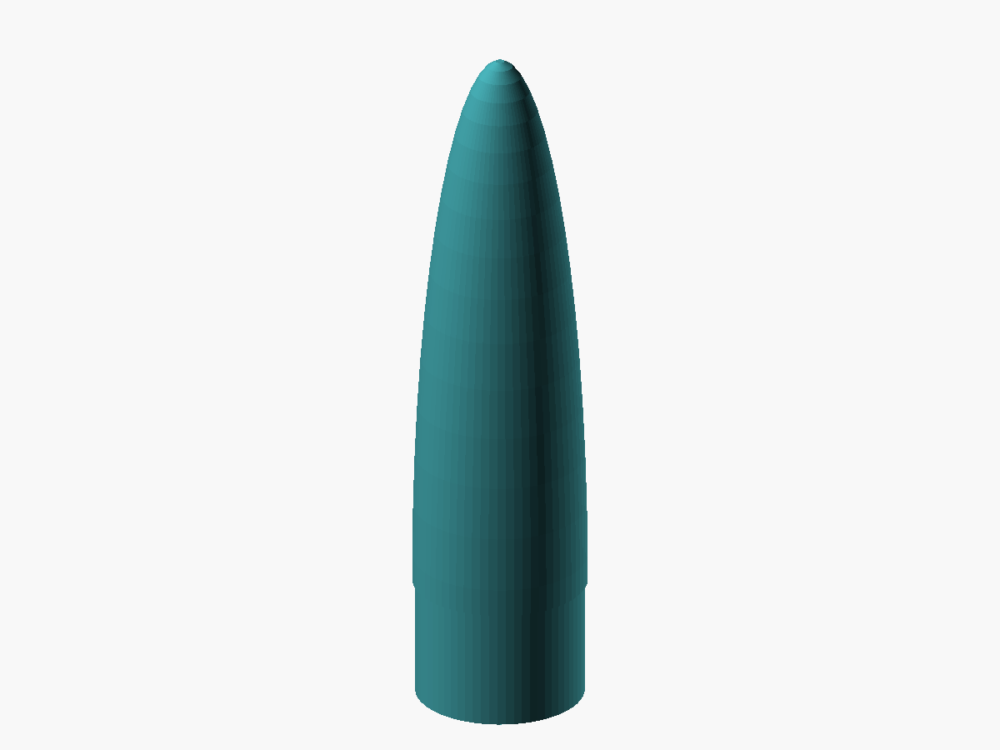 | 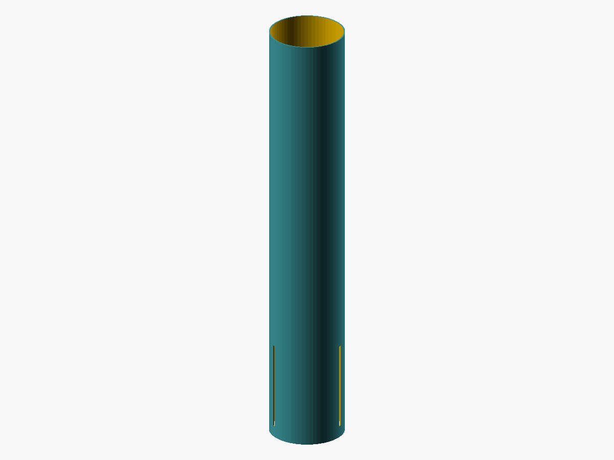 |

| Section payload | Coupleur — cotes [A] | Cloison — cotes [A] |
| --- | --- | --- |
| 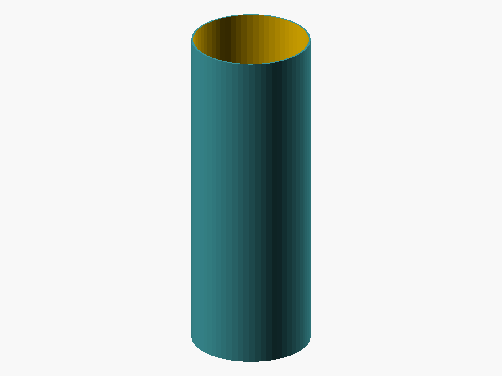 |  |  |

## Support moteur et rétention

| Tube support moteur 38 mm | Anneau de centrage | Ensemble de rétention MR-1 |
| --- | --- | --- |
|  | 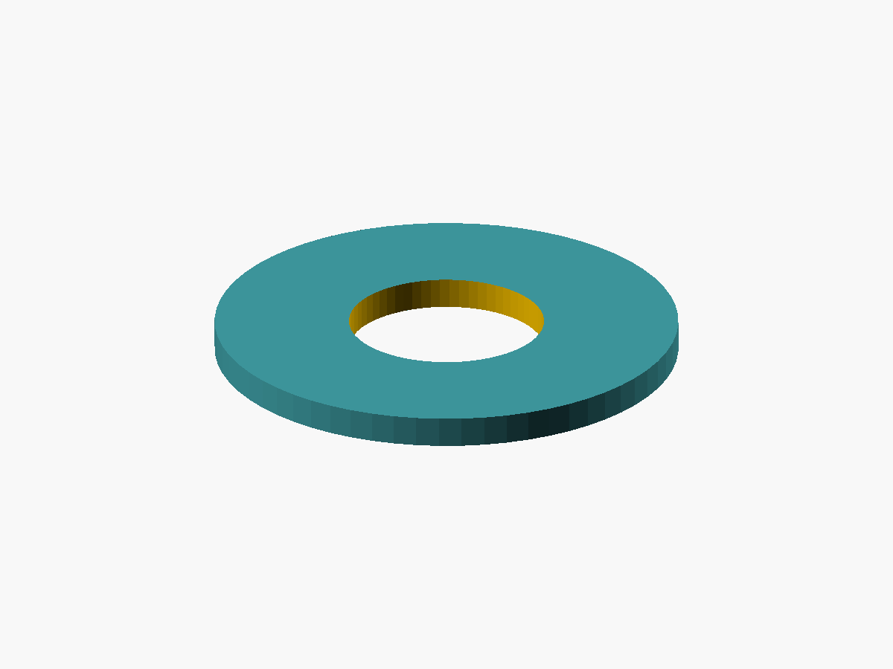 | 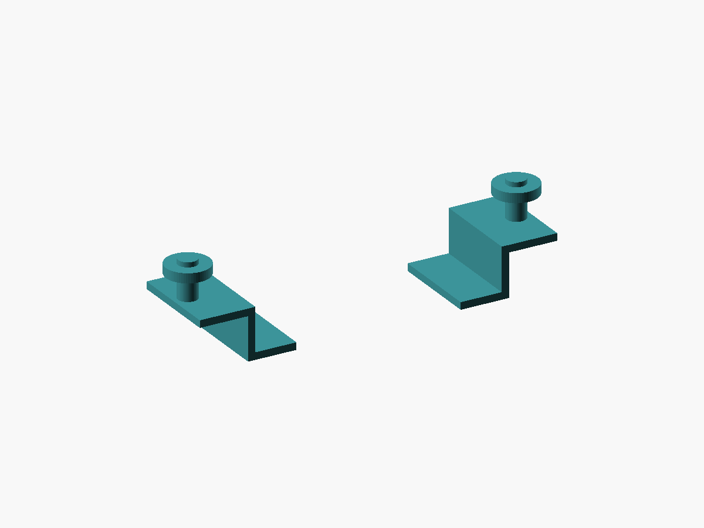 |

Les longueurs, jeux et interfaces du support sont encore estimés. L'image MR-1 représente les deux clips et leur visserie de façon schématique; elle ne constitue pas un dessin de fabrication. Les anneaux partagent les mêmes diamètres et épaisseur dans ce modèle, mais occupent des positions différentes dans la fusée.

### Point d'attache de récupération

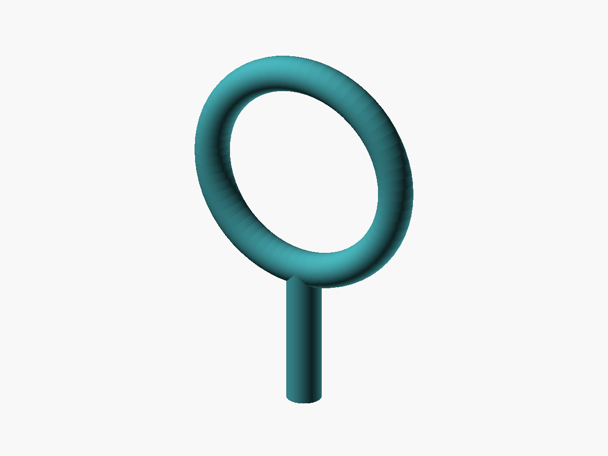

Vue isolée du module d'attache utilisé dans l'assemblage. Dimensions approximatives, sans filetages, rondelles ni détails de fixation; ce n'est pas un plan exact du SCM-3. L'export `part="eye"` est désormais disponible.

## Récupération

| Parachute rangé — volume [A] | Parachute déployé — schéma à plat | Sangle — tracé de repérage |
| --- | --- | --- |
| 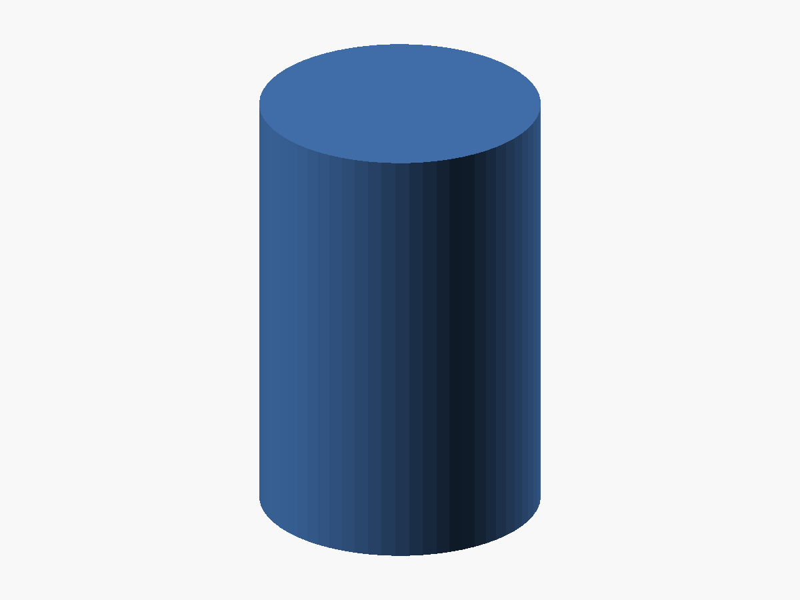 | 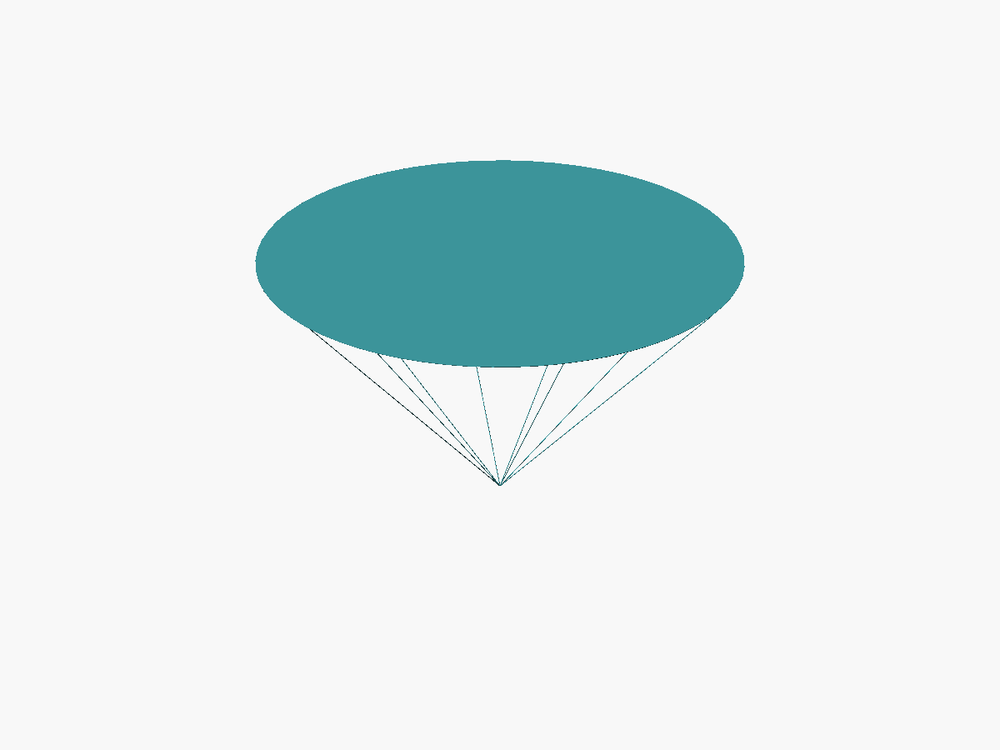 | 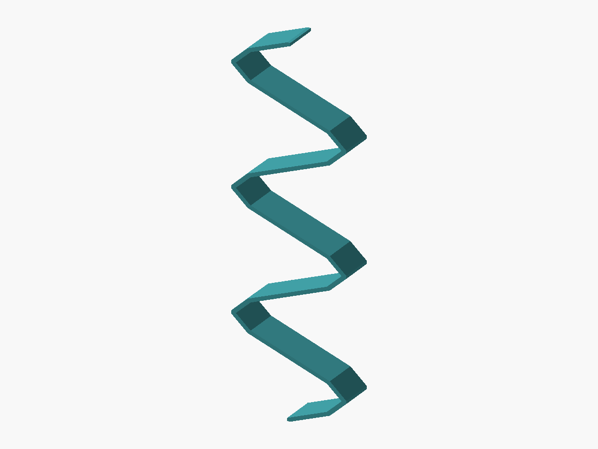 |

| Protecteur rangé — enveloppe [A] | Protecteur déplié — carré proposé de 12 po |
| --- | --- |
| 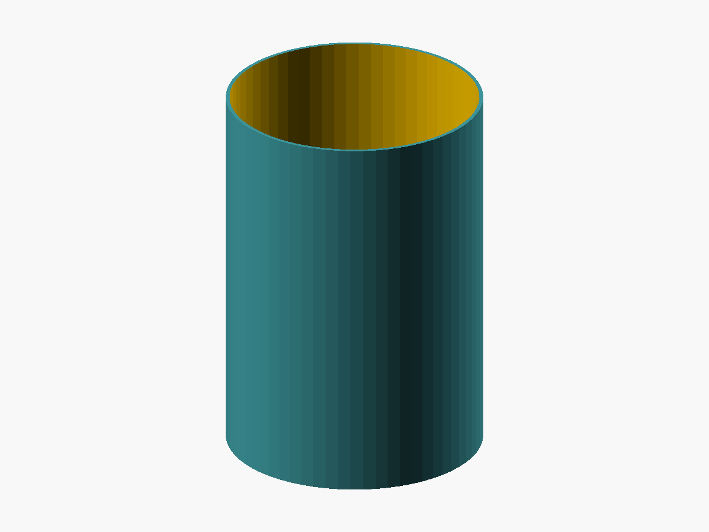 | 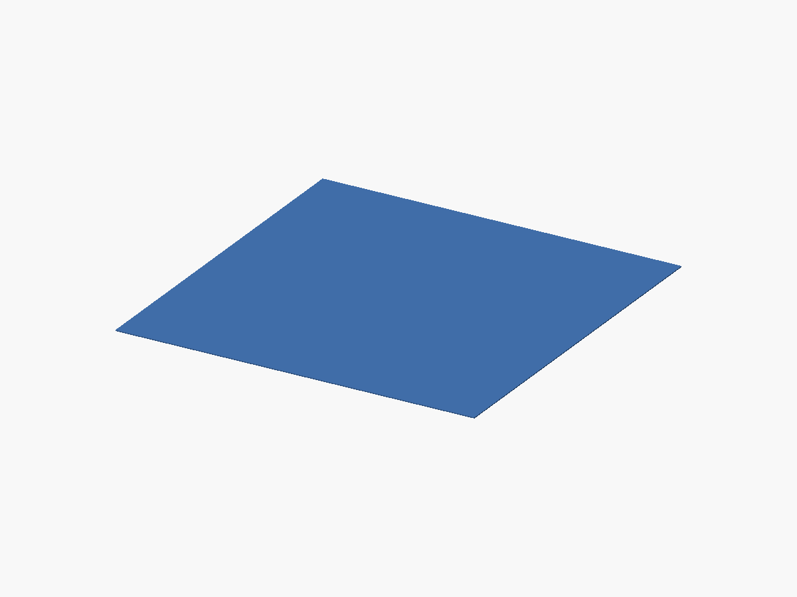 |

Le parachute déployé est un disque de tissu nominal de 36 po, pas une voile gonflée simulée. Les volumes rangés ne valident pas le pliage ou l'espace disponible. Le ruban de sangle ne développe pas sa longueur réelle de 15 pi. La taille de 12 po du protecteur reste une proposition, pas une cote confirmée du kit.

## Moteur, guidage et outil au sol

| Pro38 2G — enveloppe externe | Bouton de rail 1010 — [A] | ProDAT-38 — symbole [A] |
| --- | --- | --- |
| 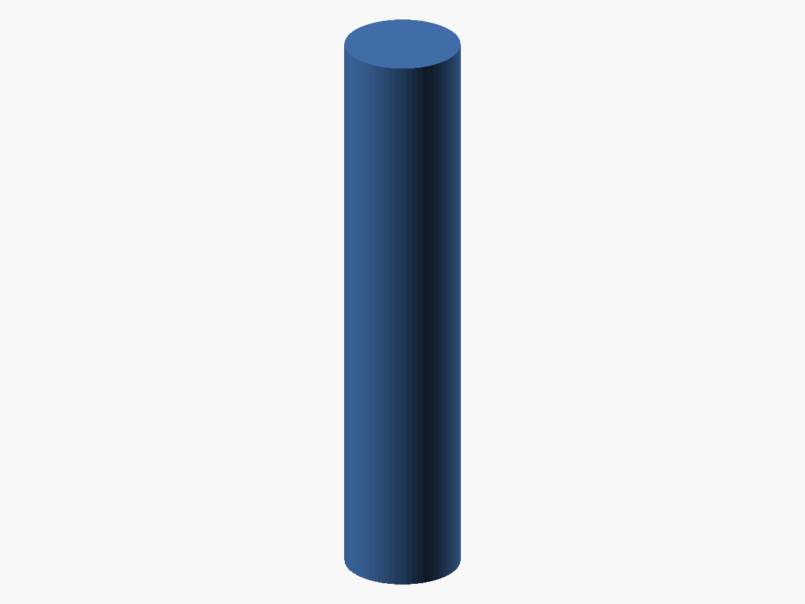 | 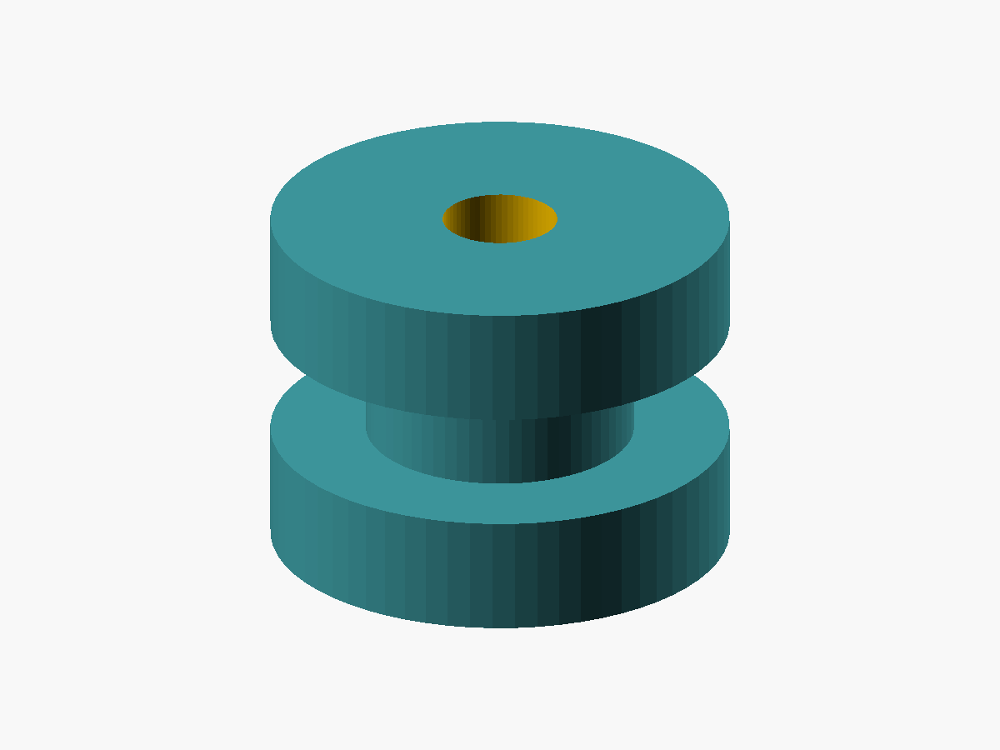 | 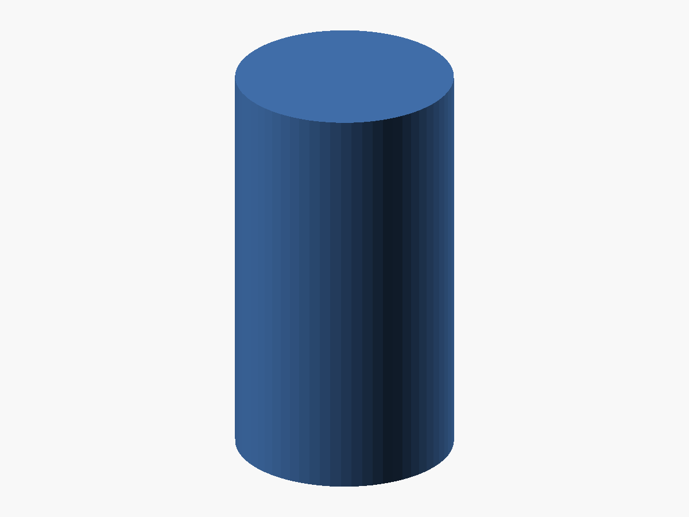 |

Le moteur est une enveloppe cylindrique de 38 × 186 mm selon le plan, identique pour ses variantes H143/H152; les détails internes et la bague de poussée sont omis. Le bouton n'est pas validé pour un rail réel. Le ProDAT est un accessoire au sol représenté par un cylindre symbolique; son image ne prétend pas reproduire la forme du produit.

## Régénérer les images

Le [script PowerShell](../outils/generer-images.ps1) génère les 18 images depuis les paramètres actuels du modèle :

```powershell
./plans/outils/generer-images.ps1
# Si OpenSCAD est installé ailleurs :
./plans/outils/generer-images.ps1 -OpenSCAD 'D:/Applications/OpenSCAD/openscad.com'
```

Il couvre les 16 valeurs exportables de `part`, avec deux états pour `parachute` et `protector`. Leur disposition d'ensemble figure dans l'[aperçu en coupe](../loc-iv-apercu.png).

Les 18 rendus ont été produits sans erreur ni avertissement et contrôlés visuellement. Pour la provenance des cotes et les limites, consulter la [notice des plans](../README.md) et la [fiche de mesures](../../notes/loc-iv-mesures-kit.md).

[Retour aux plans](../README.md)
